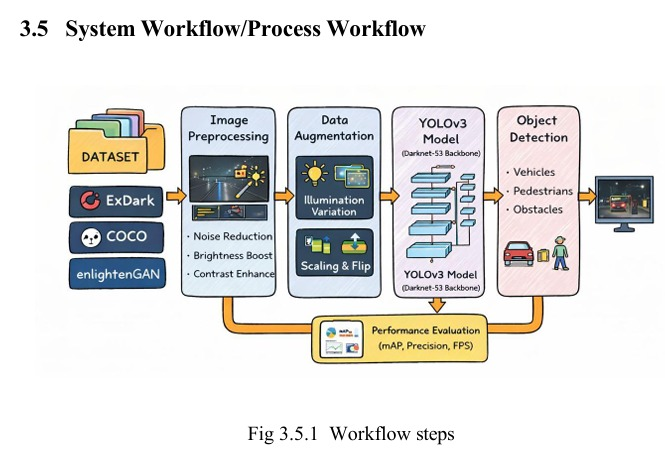

# 🌙 Low-Light Object Detection in Autonomous Vehicles using YOLOv3 and ExDark Dataset

> **Bachelor of Engineering Final Year Project**  
> Department of Information Technology, Vasavi College of Engineering (Autonomous), Hyderabad


---

# 📖 Abstract

This project proposes a robust low-light object detection system for autonomous vehicles using YOLOv3 trained on COCO and ExDark datasets. It improves detection under poor illumination using preprocessing, augmentation and real-time inference. A Google Text-to-Speech based alert system announces detected objects to improve safety.

---

# 🚗 Overview

Object detection is a critical perception task for autonomous driving. Conventional models trained on daytime datasets suffer from poor performance in tunnels, night driving and fog. This project addresses those challenges using a hybrid dataset and YOLOv3.

## Objectives

- Improve low-light object detection
- Reduce false negatives
- Maintain real-time inference
- Detect pedestrians, vehicles and obstacles
- Generate voice alerts

## Features

- Real-time image/video/webcam detection
- YOLOv3 + Darknet-53
- COCO + ExDark datasets
- Brightness enhancement
- Noise reduction
- Tkinter GUI
- gTTS voice alerts

# 🏛️ System Architecture

```text
Input → Preprocessing → Augmentation → YOLOv3 → Object Detection → Voice Alert
```

Image:

```html
<p align="center">

</p>
```

# 🔄 Workflow

```text
Capture → Enhance → Detect → Draw Bounding Boxes → Display → Speak
```

```html
<p align="center">

</p>
```

# 🛠 Tech Stack

| Category | Tools |
|---|---|
| Language | Python |
| Vision | OpenCV |
| Deep Learning | YOLOv3, TensorFlow, Keras |
| GUI | Tkinter |
| Voice | gTTS, Playsound |
| Numerical | NumPy |

# 📂 Project Structure

```text
Low-Light-Object-Detection/
├── model/
├── datasets/
├── comparison/
├── play/
├── Main.py
├── ObjectDetection.py
├── requirements.txt
├── README.md
├── arch diagram.jpeg
├── systemworkflow.jpeg
├── po-pso&sdg mapping.jpeg
└── sdg mapping.jpeg
```

# ⚙️ Installation

```bash
git clone https://github.com/YOUR_USERNAME/Low-Light-Object-Detection.git
cd Low-Light-Object-Detection
pip install -r requirements.txt
python Main.py
```

# 📚 Datasets

## COCO
General object detection dataset.

## ExDark
Low-light dataset containing more than 7,000 real dark images across multiple illumination conditions.

# 🧠 Model

YOLOv3 uses the Darknet-53 backbone and performs one-stage object detection with high speed and good accuracy, making it suitable for real-time autonomous driving.

# 📈 Performance

| Metric | Value |
|---|---:|
| mAP | 0.68 |
| FPS | 20–25 (hardware dependent) |

# 📸 Results

Add screenshots for:
- Low-light detection
- Normal detection
- Webcam output
- GUI

# 🎯 PO–PSO Mapping

```html
<p align="center">

</p>
```

# 🌍 SDG Mapping

```html
<p align="center">

</p>
```

# 🚀 Future Scope

- YOLOv8
- Vision Transformers
- LiDAR/Radar fusion
- Edge AI deployment
- Mobile app
- Cloud analytics

# 📄 Research Publication

**Enhancing Low-Light Object Detection in Autonomous Vehicles Using YOLOv3 and ExDark Dataset**

# 👨‍💻 Author

**Pallerla Sohan**  
B.E. Information Technology  
Vasavi College of Engineering  
Hyderabad, India

GitHub: https://github.com/sohanpallerla

LinkedIn: https://www.linkedin.com/in/pallerla-sohan-ba79a8246

# 🙏 Acknowledgements

- Vasavi College of Engineering
- Department of Information Technology
- Project Guide: Mr. G. Rajashekhar
- COCO Dataset
- ExDark Dataset
- OpenCV
- YOLOv3

# 📜 License

MIT License (recommended for GitHub).

---
⭐ If you found this project useful, consider starring the repository.
